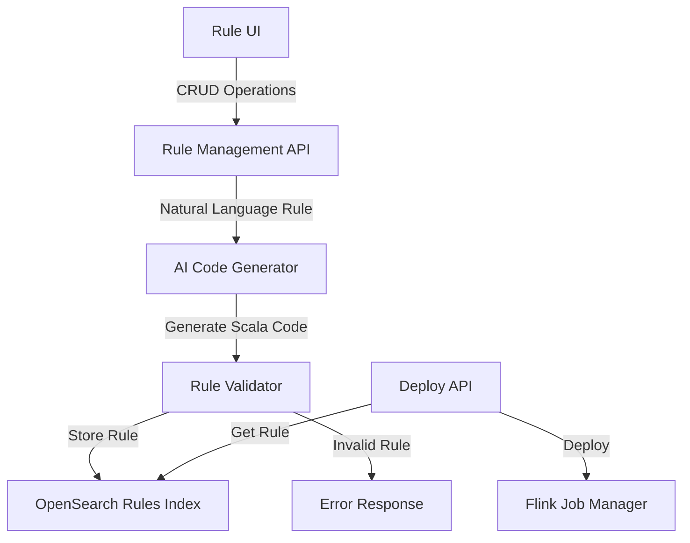

# Flink Rules Engine con AI

## Panoramica
Questo documento descrive l'architettura e l'implementazione di un motore di regole Flink che utilizza l'AI per generare codice Scala da descrizioni in linguaggio naturale.

## Architettura



## Componenti

### 1. Rule Manager Container
Container Python che espone API REST per la gestione delle regole. Utilizza lo stesso token AI del simulatore esistente per convertire le regole da linguaggio naturale a codice Scala.

#### API Endpoints
- `POST /rules/create`: Crea una nuova regola
  - Input: Descrizione in linguaggio naturale
  - Output: Codice Scala generato + metadata
- `PUT /rules/{id}`: Aggiorna una regola esistente
- `DELETE /rules/{id}`: Elimina una regola
- `GET /rules`: Lista tutte le regole
- `POST /rules/{id}/deploy`: Deploya una regola su Flink

### 2. OpenSearch Rules Index

Schema dell'indice per la memorizzazione delle regole:
```json
{
  "rule_index": {
    "mappings": {
      "properties": {
        "rule_id": { "type": "keyword" },
        "name": { "type": "text" },
        "natural_language": { "type": "text" },
        "scala_code": { "type": "text" },
        "status": { "type": "keyword" },
        "created_at": { "type": "date" },
        "updated_at": { "type": "date" },
        "deployed_at": { "type": "date" },
        "version": { "type": "integer" },
        "is_active": { "type": "boolean" }
      }
    }
  }
}
```

### 3. Flink Integration (Versione 2.x)
- Job Manager per la gestione dei job Flink
- Task Manager per l'esecuzione delle regole
- Integrazione con Kafka per input/output
- Monitoraggio tramite Grafana

#### Vantaggi di Flink 2.x
- Migliore integrazione Python-Flink per il Rule Manager
- API unificate per batch e streaming
- Scheduler adattivo per ottimizzazione risorse
- Gestione stato più efficiente
- Supporto migliorato per UDF Python

## Flussi di Processo

### Creazione Regola
1. L'utente invia una descrizione della regola in linguaggio naturale
2. Il sistema utilizza l'AI per generare il codice Scala corrispondente
3. Il codice viene validato
4. La regola viene salvata in OpenSearch con stato "created"

### Deploy Regola
1. L'utente richiede il deploy di una regola
2. Il sistema recupera il codice Scala da OpenSearch
3. Viene creato e deployato un nuovo job Flink
4. Lo stato della regola viene aggiornato a "deployed"

## Architettura Docker

Il sistema utilizza una configurazione Docker distribuita su due file docker-compose:

### 1. docker-compose.yml principale (esistente)
Gestisce il flusso dati core:
- CSV Generator
- Kafka + Zookeeper
- Logstash (input/output)
- OpenSearch + Dashboard
- Grafana

### 2. docker-compose.yml del Rule Manager
Gestisce il sistema di regole mantenendo l'integrazione con i servizi core:

```yaml
# Struttura logica del docker-compose.yml del Rule Manager
services:
  rule-manager:
    # API service per gestione regole
    networks:
      - fraud-network
      - rules-network

  jobmanager:
    # Flink Job Manager
    networks:
      - rules-network

  taskmanager:
    # Flink Task Manager
    networks:
      - rules-network

networks:
  fraud-network:
    external: true
  rules-network:
    driver: bridge
```

### Vantaggi della Separazione
- Sviluppo e test indipendenti del sistema di regole
- Riutilizzo dell'infrastruttura esistente (Kafka, OpenSearch)
- Scalabilità separata dei componenti
- Gestione più semplice degli aggiornamenti
- Isolamento delle problematiche

### Integrazione
- La rete `fraud-network` viene condivisa tra i due compose
- Il Rule Manager può accedere a Kafka e OpenSearch
- I job Flink possono leggere da Kafka e scrivere risultati
- Monitoraggio unificato tramite Grafana

### Deployment
1. Avvio del sistema core:
```bash
cd fraudM
docker compose up -d
```

2. Avvio del sistema di regole:
```bash
cd fraudM/rule-manager
docker compose up -d
```

## Configurazione Docker

```yaml
services:
  rule-manager:
    build:
      context: ./rule-manager
      dockerfile: Dockerfile
    environment:
      - GEMINI_API_KEY=${GEMINI_API_KEY}
      - OPENSEARCH_URL=http://opensearch:9200
      - FLINK_URL=http://jobmanager:8081
    ports:
      - "5001:5001"
    networks:
      - fraud-network

  jobmanager:
    image: apache/flink:2.0.0
    ports:
      - "8081:8081"
    command: jobmanager
    environment:
      - |
        FLINK_PROPERTIES=
        jobmanager.rpc.address: jobmanager
        jobmanager.memory.process.size: 1600m
        jobmanager.memory.jvm.heap.size: 1024m
        python.executable: python3

  taskmanager:
    image: apache/flink:2.0.0
    depends_on:
      - jobmanager
    command: taskmanager
    environment:
      - |
        FLINK_PROPERTIES=
        taskmanager.memory.process.size: 1728m
        taskmanager.memory.framework.heap.size: 128m
        taskmanager.memory.task.heap.size: 256m
        taskmanager.memory.network.min: 64m
        taskmanager.memory.network.max: 64m
        taskmanager.numberOfTaskSlots: 2
        jobmanager.rpc.address: jobmanager
        python.executable: python3
```

## Esempio di Utilizzo

### 1. Creazione di una Regola

```bash
curl -X POST http://localhost:5001/rules/create \
  -H "Content-Type: application/json" \
  -d '{
    "description": "Genera un alert quando un caller effettua più di 20 chiamate in 2 minuti verso numeri diversi"
  }'
```

### 2. Deploy della Regola

```bash
curl -X POST http://localhost:5001/rules/{rule_id}/deploy
```

## Monitoraggio

- Dashboard Grafana per monitoraggio regole
- Metriche Flink per performance
- Log delle esecuzioni in OpenSearch
- Alerting su errori o anomalie

## Sicurezza

- Autenticazione per le API
- Validazione del codice generato
- Logging di tutte le operazioni
- Backup periodico delle regole

## Scalabilità

- Architettura distribuita con Flink
- Scalabilità orizzontale dei Task Manager
- Caching delle regole frequenti
- Ottimizzazione delle query OpenSearch