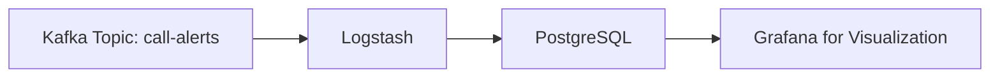

# PostgreSQL Integration for Call Alerts

## Overview
This document outlines the integration between Kafka and PostgreSQL for storing call alerts data.

## Database Schema
The following SQL schema will be used to create the table for storing call alerts:

```sql
CREATE TABLE call_alerts (
    xdrid VARCHAR(36) PRIMARY KEY,
    tenant VARCHAR(50),
    val_euro DECIMAL(10,2),
    duration INTEGER,
    raw_caller_number VARCHAR(20),
    raw_called_number VARCHAR(20),
    timestamp TIMESTAMP,
    event_time TIMESTAMP
);
```

## Implementation Steps

1. Create PostgreSQL initialization script:
   - Place the schema creation SQL in `fraudM/postgres/db_init.sql`
   - The script will automatically run when the PostgreSQL container starts

2. Add Logstash Pipeline Configuration:
   - Create a new pipeline file `kafka-to-postgres.conf`
   - Configure input from Kafka topic 'call-alerts'
   - Configure output to PostgreSQL using JDBC

3. Update docker-compose.yml:
   - Add PostgreSQL JDBC driver to Logstash
   - Configure the new pipeline

## Data Flow


## Next Steps
1. Switch to Code mode to implement the database initialization script
2. Create the Logstash pipeline configuration
3. Update docker-compose.yml with necessary changes
4. Test the integration