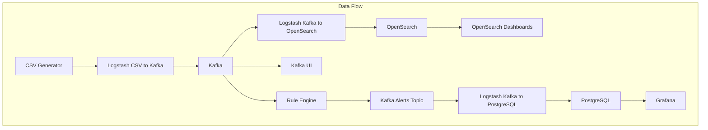

# Architecture Diagram for FraudM Project



## Overview

The FraudM project is designed to process and analyze data for fraud detection. It consists of several interconnected components that handle data generation, processing, storage, and visualization.

### Key Components and Their Roles

1. **CSV Generator**:
   - Generates synthetic CSV files containing data for analysis using Gemini AI.
   - Saves the files in a shared directory (`./data`) for further processing.
   - Exposed on port 5000 for interaction.
   - Requires `GEMINI_API_KEY` environment variable to be set.

   To run the service, replace the XXXXX placeholder in the `.env` file with your Gemini API key, then use:
   ```bash
   docker compose up
   ```

2. **Rule Engine Components**:
   - **Rule Manager**:
     - Manages and executes fraud detection rules through an API.
     - Consumes data from Kafka for real-time analysis.
     - Uses AI to assist in rule generation and management.
     - Exposes APIs for rule creation and management.
     - Available on port 8000.
   - **Rule Execution Engine**:
     - Processes rules against data streams from Kafka in real-time.
     - Evaluates conditions and triggers actions based on rule definitions.
     - Writes alert results to a dedicated Kafka topic for PostgreSQL storage.

3. **Zookeeper**:
   - Coordinates and manages the Kafka cluster.
   - Ensures proper synchronization between Kafka brokers.
   - Exposed on port 2181.

4. **Kafka**:
   - Acts as a message broker to handle data streams.
   - Receives data from Logstash and distributes it to other components.
   - Contains separate topics for raw data and processed alerts.
   - Exposed on ports 9092 (host) and 29092 (internal).

5. **Kafka UI**:
   - Provides a web-based interface to monitor and manage Kafka topics and messages.
   - Exposed on port 8080 for easy access.

6. **Logstash Pipelines**:
   - **CSV to Kafka**: Reads CSV files from the shared directory and sends the data to Kafka topics.
   - **Kafka to OpenSearch**: Consumes data from Kafka topics and sends it to OpenSearch for indexing and analysis.
   - **Kafka to PostgreSQL**: Consumes alert data from Kafka and stores it in PostgreSQL for real-time monitoring.

7. **PostgreSQL**:
   - Stores call alert data for real-time monitoring and analysis.
   - Contains the `call_alerts` table with detailed call information.
   - Exposed on port 5432.
   - Includes utility scripts for monitoring (see below).

8. **OpenSearch**:
   - A search and analytics engine used to store and analyze data.
   - Provides APIs for querying and retrieving data.
   - Exposed on ports 9200 (API) and 9600 (monitoring).

9. **OpenSearch Dashboards**:
   - A visualization tool for creating dashboards and analyzing data stored in OpenSearch.
   - Exposed on port 5601 for user interaction.

10. **Grafana**:
    - A monitoring and analytics platform used to create advanced visualizations and dashboards.
    - Connects to PostgreSQL to display real-time call alert metrics and insights.
    - Includes pre-configured dashboard for call alerts monitoring.
    - Exposed on port 3000.

### Utility Scripts

- **count_call_alerts.sh**: Quickly check the number of call alerts in PostgreSQL
  ```bash
  ./script-util/count_call_alerts.sh
  ```

### Monitoring Dashboards

1. **Call Alerts Dashboard**:
   - Shows real-time call alert data from PostgreSQL
   - Accessible in Grafana at http://localhost:3000
   - Displays:
     - Recent call alerts
     - Call statistics
     - Alert patterns

### Network and Volumes

- **Network**: All components are connected via the `fraud-network` bridge network to ensure seamless communication.
- **Volumes**:
  - `opensearch-data`: Persistent storage for OpenSearch to retain indexed data.
  - `data`: Shared directory for CSV files and other intermediate data.
  - `postgres-data`: Persistent storage for PostgreSQL data.

## Getting Started

To start the entire FraudM system:

1. First, ensure you have the required environment variables set:
   ```bash
   cd fraudM/rule-manager
   cp .env.example .env
   # Edit .env and set your GEMINI_API_KEY
   ```

2. Start all services:
   ```bash
   cd fraudM
   ./start.sh
   ```

The start script will launch all components in the correct order. Once started, you can access:

- Rule Manager API: http://localhost:8000
- Kafka UI: http://localhost:8080
- OpenSearch Dashboards: http://localhost:5601
- Grafana: http://localhost:3000 (admin/admin)
- PostgreSQL Adminer: http://localhost:8090

To clean up and stop all services:
```bash
./cleanup.sh
```

This architecture enables efficient data processing and visualization, making it suitable for fraud detection and monitoring use cases.
